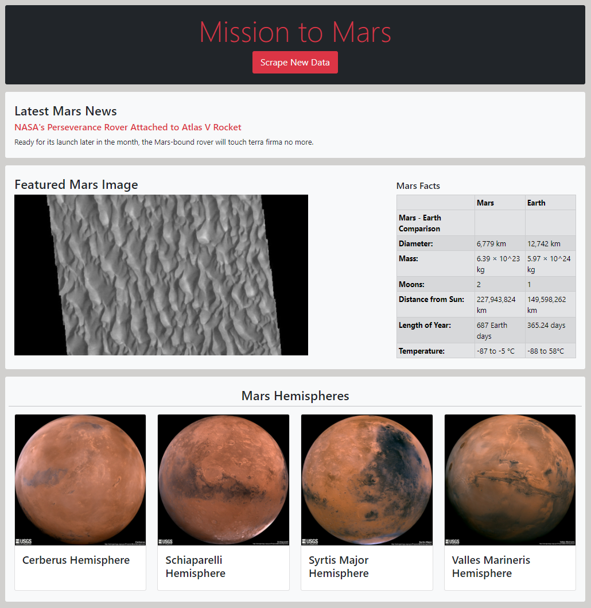

# H12_Web-Scraping-challenge
## Web App: Scrape data from various websites & Display in a single HTML page

### Description
The scope of this project is to build a web application that scrapes various websites for data related to the Mission to Mars and displays the information in a single HTML page.

### Script Summary
This web application was built using Python, Flask, HTML & Bootstrap. Data scraping was carried out using Beautiful Soup and Splinter and a NoSQL Database (MongoDB) was used to store and retrieve data with PyMongo. 

### Workflow

#### 1. Scraping (Beautiful Soup & Splinter)

**a) **

#### 2. Web Application (Flask & MongoDB)

### Full-size Screenshot
